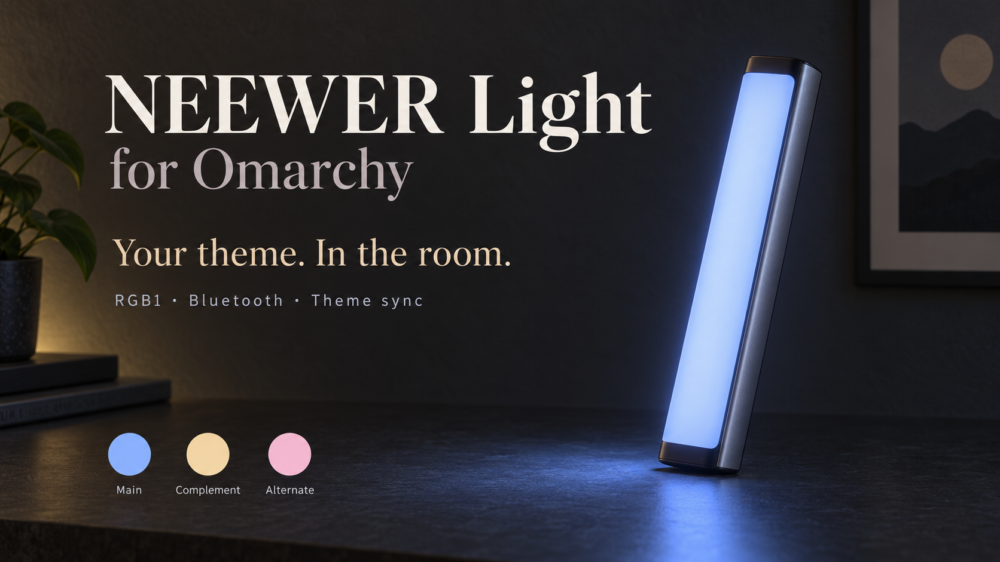

# NEEWER Light for Omarchy

**Your theme. In the room.**

Match a **NEEWER RGB1 light stick** to your Omarchy theme, directly over Bluetooth. Pick a colour from your current palette, adjust the brightness, or let the light fade gently between three theme colours—all from the bar.



*Illustrative product artwork; the controls use Omarchy's native theme and widgets.*

## What it does

- **Fades with your desktop.** Switching Omarchy themes blends the connected light into the new palette with a short fade matched to Omarchy's transition.
- **Three useful colours.** Main, Complement and Alternate come from the active theme. Click a swatch to preview it immediately.
- **Gentle ambient fades.** Optional Cycle blends between those colours. Choose Slow, Medium or Fast; turning Cycle off holds the current blend.
- **Simple everyday controls.** Brightness, On, Off and Follow theme. Your choices are saved.
- **A connection that stays ready.** A local background helper maintains the selected RGB1 connection and retries if it drops.
- **Automatic power, if you want it.** Preferences can turn the light off when you lock, restore it on unlock, and send Off before a normal shutdown or restart.

Tested with one **NEEWER RGB1** on **Omarchy 4.0.4**. Other NEEWER lights, older Omarchy desktops without the plugin system, and multiple-light setups are not supported by this release.

## Install

You need Omarchy 4 with native shell plugins, computer Bluetooth, and an RGB1 with Bluetooth enabled. Python 3.11 or newer is required; current Omarchy includes it. Keep an internet connection for the one-time helper download.

```bash
omarchy plugin add https://github.com/tomdavenport/omarchy-neewer-light.git --enable
```

Click the light-bulb icon in your bar, then **Enable light controls**. This explicit first-use step installs the Bluetooth dependencies into a private Python environment and enables a service for your user. It needs no administrator password or cloud account. Nothing is downloaded merely by opening the widget before you press that button.

### Connect your RGB1

1. Switch the light on and turn on Bluetooth on your computer.
2. Disconnect the NEEWER phone app. If it keeps reconnecting, temporarily turn Bluetooth off in the phone's **Settings**.
3. In the widget, click **Find light**, select your RGB1, then **Test colour**.
4. When the light changes to the displayed colour, click **Looks right**.

**You do not need to pair it in the computer's Bluetooth menu first.** This utility connects directly to the light.

If it is not found, hold the RGB1 button marked **2.4G** for about **1.5 seconds**, until the Bluetooth symbol flashes, then find it again. The button is labelled 2.4G on the original RGB1 even though this selects Bluetooth mode. See the [RGB1 manufacturer manual](https://www.bhphotovideo.com/lit_files/1197774.pdf) for the control layout.

Only matching RGB1 devices appear in the list. The final confirmation is available after a successful test write, so you can check that you selected the right light.

## Everyday use

| Control | What happens |
| --- | --- |
| **Main / Complement / Alternate** | Applies that theme colour immediately and stops Cycle. |
| **Brightness** | Keeps your selected level through colour and theme changes. |
| **Cycle theme colours** | Fades through the three theme colours; off holds the current blend. |
| **Speed** | Slow: 12 seconds per fade. Medium: 6 seconds. Fast: 3 seconds. |
| **Follow theme** | Keeps the light connected and follows Omarchy theme changes. Turning it off stops Cycle and releases the connection for the phone app. |
| **Off** | Keeps the light off through theme changes and reconnects. On, a swatch preview or starting Cycle turns it on again. |
| **Preferences** | Theme fade: Gentle (1 second), Quick (0.42 seconds), or Off. Separate switches for off when locked and off on shutdown. |

Start with **Cycle on Slow** for gentle room lighting. Faster fades can show small steps when you look directly at the LEDs. If brightness was zero, On or a swatch preview restores your last nonzero level.

**Theme fade and Cycle are separate:** theme fade runs once when the desktop theme changes; Cycle repeats through the palette. Stopping Cycle holds the last colour sent, including when a theme fade was in progress.

### Automatic power

Open **Preferences** to enable **Off when locked** and/or **Off on shutdown**. Both start off for new installations. Locking can temporarily turn the light off; unlocking restores it only after a successful automatic Off and if you have not manually switched it off. The helper remembers a successful automatic Off across restarts. Manual Off stays off.

Lock detection uses Hyprland's public `hyprland_lock_notify_v1` protocol, available on the tested Hyprland 0.56.2. It subscribes only to lock notifications, with no screenshot, window or input access. The panel reports when the protocol is unavailable. Shutdown detection uses systemd-logind with a delay capped at 1.5 seconds (or the system's shorter limit) for the off attempt. A normal helper upgrade does not trigger shutdown Off. Radio unavailability, forced shutdown and sudden power loss can prevent delivery; these settings cannot guarantee an off command reaches a disconnected light.

The three swatches are exact colours from the active theme: Main uses its accent; Complement favours a contrasting hue; Alternate adds a third distinct palette colour. During a fade the light displays intermediate blends. Monochrome themes may produce similar-looking choices. The light's hue/saturation controls and separate brightness mean it will not exactly match a calibrated screen.

Keyboard support: Tab or arrow keys move between controls, Enter activates, Left/Right adjusts a selected brightness slider, and Escape goes back or closes. The panel scrolls on smaller displays.

## Connection help

**Not found:** check the light is on, Bluetooth is enabled, and the phone has released it. Enter Bluetooth mode as described above, then try Find light again.

**Found, but cannot connect:** leave the light nearby and disconnect other apps controlling it. The widget shows whether it is connecting or offline. If the computer's Bluetooth stack is stuck, a manual Bluetooth restart may help, but it interrupts other accessories; this plugin never resets the adapter automatically.

**Connected, but dark:** check Brightness and try Main. If the light is physically powered off, its Bluetooth radio cannot receive an On command; switch it on at the light first.

**Want the phone app back:** turn Follow theme off before connecting the phone.

**Setup failed:** check internet access and try the setup button again. Details are saved locally at `~/.local/state/neewer-omarchy/setup.log`. This release is for Omarchy with a working user systemd session and BlueZ Bluetooth service.

## What is installed

The widget asks before installing its local helper. It downloads pinned **Bleak 3.0.2** and **dbus-fast 5.0.22** from Python's package index. A Python virtual environment keeps them separate from system packages. The helper uses BlueZ and logind over the system D-Bus, a private local control socket, and an optional Wayland lock-notification connection; there is no web server, telemetry or account. The selected Bluetooth address is stored only in your local settings.

- Plugin source: `~/.config/omarchy/plugins/io.github.tomdavenport.neewer/`
- Helper and its environment: `~/.local/share/neewer-omarchy/`
- Your saved light and preferences: `~/.config/neewer-omarchy/config.json`
- Local status and setup log: `~/.local/state/neewer-omarchy/`
- User service: `~/.config/systemd/user/neewer-light.service`
- Command: `~/.local/bin/neewer-light`
- Theme hook: `~/.config/omarchy/hooks/theme-set.d/50-neewer-light`

Setup preserves the saved light and brightness. Before replacing helper files it saves local before-images under `~/.local/share/neewer-omarchy/backups/`. It does not alter system Bluetooth configuration, firmware, unrelated bar widgets or shell settings. The user service starts at login and keeps running when the panel is closed.

Theme-file events provide the quick response; the theme hook is a fallback. While steady, the helper refreshes the colour every five seconds without repeatedly sending power On. Fades use paced, serial writes and skip redundant or missed frames. This is connection maintenance, not a guarantee against radio interference or a powered-down light.

Theme changes use a gentle one-second ease-in/ease-out by default, starting near the background transition. Quick uses Omarchy 4's 420 ms duration; Off applies the new palette immediately. They blend from the last colour sent to the RGB1, including during Cycle. Colour previews stay immediate. The background-file event provides approximate alignment; Bluetooth latency and wallpaper loading can affect the visible timing. Reconnecting lights apply the latest palette directly.

## Update

```bash
omarchy plugin update io.github.tomdavenport.neewer
```

Open the widget. If the helper needs the new release, press **Enable light controls** once; your saved settings are kept.

## Remove

Turn Follow theme off to release the light. To remove the plugin and its background helper:

```bash
bash ~/.config/omarchy/plugins/io.github.tomdavenport.neewer/scripts/uninstall.sh
omarchy plugin remove io.github.tomdavenport.neewer
```

Uninstall stops/disables only the dedicated light service and removes its command, hook and helper environment. It preserves your light preferences and local logs. For a complete reset, also remove `~/.config/neewer-omarchy/` and `~/.local/state/neewer-omarchy/` after uninstalling.

Removing only the bar widget does not uninstall the separate background helper.

## Command line

After first-use setup:

```bash
neewer-light status
neewer-light preview accent
neewer-light preview complementary
neewer-light preview alternate
neewer-light brightness 30
neewer-light mode cycle
neewer-light speed slow
neewer-light mode steady
neewer-light off
neewer-light on
neewer-light follow off
neewer-light fade gentle
neewer-light lock-off on
neewer-light shutdown-off on
```

## Development and tests

```bash
python3 -m venv /tmp/neewer-dev-venv
/tmp/neewer-dev-venv/bin/python -m pip install -r requirements.txt
PYTHONPATH=backend /tmp/neewer-dev-venv/bin/python -m unittest discover -s tests -v
omarchy plugin validate .
```

Tests use simulated Bluetooth devices, temporary settings, a fake Wayland socket and simulated shutdown events. They never lock or shut down the host. No real light is required. The panel's JavaScript ordering regression runs when Node is available; optional installed-theme checks skip on machines without Omarchy. Source validation does not replace testing the native UI on a fresh Omarchy machine.

## Licence and credits

MIT. Bluetooth protocol work was informed by [NeewerLite-Python](https://github.com/taburineagle/NeewerLite-Python) and [NeewerLite](https://github.com/keefo/NeewerLite); the applicable NeewerLite-Python MIT notice is retained in [third-party notices](docs/LICENSE.NeewerLite-Python).

Independent community software by Tom Davenport. Not affiliated with NEEWER or the Omarchy project. NEEWER and RGB1 identify the compatible hardware. The cover is AI-generated illustrative artwork, not a screenshot or official manufacturer image.
